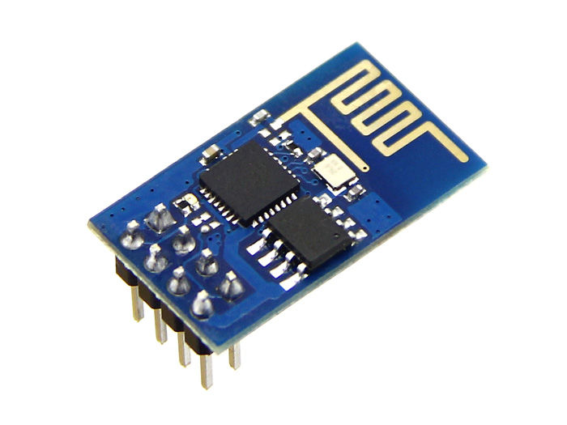
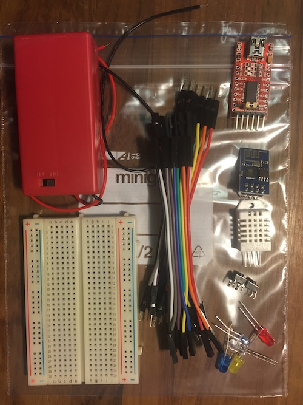
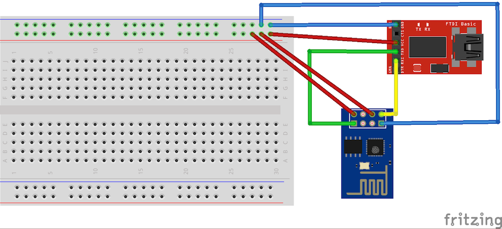
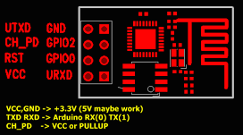
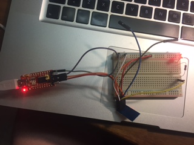

# Getting started with ESP-8266

ESP-8266 is an exciting microcontroller that features integrated Wifi, a bunch of GPIOs including
analog to digital conversion and PWM and power-saving features like deep sleep. And it costs just 3 euros.

It's available in a few different modules, namely ESP-01, ESP-03, ESP-07 etc. The interesting ones for me
are

- ESP-01 where 8 pins are available as a header block, so you can connect female jumper wires without soldering
- ESP-03 where most interesting pins are available (not RESET though) for you to solder your wires into
- ESP-07 where also RESET is available. This is the go-to board for a hobbyist who can solder and needs deep-sleep wakeup pin (GPIO16).

Here's a nice breakdown of different modules: http://www.voti.nl/blog/?p=52

For me the most interesting pin missing from the ESP-01 is the `GPIO16/XPD_DCDC` pin that's needed for being able
to wake up from deep sleep mode.



Anyway, the ESP-01 (pictured above) is by far the easiest one to get started with.

## Starter kit

Here's what you need to get started with IoT with the ESP8266 chip.

- A couple of ESP01 and ESP03 modules
- Male-male and male-female jumper wires
- A breadboard for making connections
- 2 AA batteries and a battery holder
- FTDI USB adapter for communications with your laptop

This stuff will cost you around 10€ if you order just one ESP module. I strongly
recommend ordering more though, as they are not so hard to burn and not too
expensive to buy.

In addition, you'll probably want to order some

- LED's
- Push buttons
- Resistors (see below)
- Sensors, such as the DHT-22 humidity sensor
- A USB extension cord to plug between your computer and the FTDI adapter

You'll need 10kΩ resistors for button/sensor pull-up/pull-down purposes and 100Ω for use with LED.
You can buy a huge assortments of resistors for 1€.

Here's what your starter kit might look like:



## Wiring

Minimal wiring to get started. You need an FTDI adapter in your USB port. 

Make sure your FTDI adapter uses 3.3 volts! In some adapters (such as the one
in the starter kit) there's a jumper for selecting the voltage, between 5 volts
and 3.3 volts. Make one mistake and burn your ESP.

```
FTDI GND       <-> ESP01 GND
FTDI RX        <-> ESP01 TX
FTDI TX        <-> ESP01 RX
FTDI VCC       <-> ESP01 VCC
FTDI VCC       <-> ESP01 CH_PD
```

It should look like this:



See the following "pinout" image for which pin is which on the ESP-01.



Now, you might also need an external power source, such as a pair of AA batteries, providing at least 3 volts.
This is because at least some of my FTDI adapters aren't able to provide enough current for the ESP to work
reliably. So, in case your ESP doesn't work reliably in your later experiments, you may make more connections:

```
3V battery -   <-> ESP01 GND
3V battery +   <-> ESP01 VCC, ESP01 CH_PD
```

Also, prepare to be able to connect `RST` to `GND` to reset the device. Later on, you'll also want to
burn a new program on the flash memory and need to connect also `GPIO0` to `GND`.

If you've connected it properly (actually just GND and VCC are needed), the chip will power up and a
red led will light up.

When it starts, it will also flash the blue led briefly (given that you connected CH_PD to 3v) to indicate
that it woke up from reset. If you connect the `RST` pin to `GND` it will reset itself and you should see
a flash of blue again.

## NodeMCU

The NodeMCU is a nice little development board that has an ESP8266 on it and 
makes stuff a bit easier. Just connect it with USB and you're ready to go. Remember that NodeMCU uses
9600 baud serial instead of 115200 that ESP01 uses by default.

Anyways, let's go back to development without training wheels...

## Talking serial

When your ESP is connected via FTDI, you can connect to it using a terminal emulator such as `screen`, which
I'll be using in this example. My instructions here apply to OSX and possibly to Linux too.

Now

    ls /dev/cu*

If you're lucky, you'll see something like

    /dev/cu.Bluetooth-Incoming-Port  /dev/cu.HC-06-DevB  /dev/cu.wchusbserialfa140

In this case the `/dev/cu.wchusbserialfa140` one is my ESP. If you're not sure which on is your ESP,
unplug it, do `ls /dev/cu*`, plug it again and `ls /dev/cu*` again. The one that appears in the latter
listing is your ESP. If nothing appears, you're missing the drivers for your FTDI adapter.

When you've found the ESP from the `/dev/cu*` list, you can connect to it using `screen`:

    screen /dev/cu.wchusbserialfa140 115200

I've heard that not all ESP01's use baud rate 115200, so if this doesn't work, you might try another baud rate
like 9600.

When you're connected with screen, you can try some AT commands, like simply `at`. The catch is that after each
command you need to enter both CR and LF. This can be done by pressing `<ctrl-m><ctrl-j>` after each command.

So, try

    at<ctrl-m><ctrl-j>

And you should get a reply "ok". Now you can try connecting to Wifi and listing available networks:

    AT+CWMODE=3
    AT+CWLAP

And finally, join a network:

    AT+CWJAP="my ssid","my password"

More AT commands [here](http://www.pridopia.co.uk/pi-doc/ESP8266ATCommandsSet.pdf).

Remember that you can always reset your device by connecting `RST` to `GND`. That'll result to a load
of binary garbage being dumped into your terminal, but fear not, it's normal. Another way to reset
the ESP is to turn the power off for a while.

... and that you can exit `screen` by typing `<ctrl-a>`, `k`.

## Programming the ESP

Sending AT commands via serial is fun, but coding C++ is even more fun! Programming the ESP-8266 is surprisingly easy to
get started with, especially if you're already familiar with programming the Arduino. Now that you've already got
the wiring an serial communcation covered, let's start coding.

1. Install the [Arduino IDE](https://www.arduino.cc/en/main/software)
2. Install the [ESP-8266 Arduino core](https://github.com/esp8266/Arduino) to your Arduino IDE
3. Start coding

When you've got this stuff installed, you'll find some new ESP8266 examples in the Examples menu of your
Arduino menu. Personally, I started with the classic "blinking LED" code though. Like this:

```cpp
void setup() {
  pinMode(2, OUTPUT);
}

void loop() {
  digitalWrite(2, HIGH);
  delay(500);
  digitalWrite(2, LOW);
  delay(500);
}
```

It's here assumed that you've connected a LED between the `GPIO2` and `GND` pins of your ESP. This is
very easy if you're using a breadboard and an ESP-01 module. You should actually also place a 100ohm resistor between
the LED and GND, for the longevity of the LED. Personally, I haven't yet burnt a LED with 3.3 volts
without a resistor though.

Below there's a picture of my circuit with the LED and all. The loose wires are connected to the the RST (brown) and
GPIO0 (blue) pins of the ESP-01 module.



To upload your sketch onto the ESP, you need to do the following:

1. In your Arduino IDE, select Board = Generic ESP8266 Module and the correct Port
2. Reset your ESP while pulling GPIO0 down. Practically you connect both RST and GPIO0 to GND, then
release them in the order RST, GPIO0. It's crucial that the GPIO0 pin is down when you release the
RST pin. Now your ESP will boot to the "send me new software via serial" mode.
3. Upload sketch from Arduino IDE. The upload will take several seconds and you'll see the upload
progress in the Arduino IDE.
4. If this worked, your ESP will start blinking the led and you win!

With the NodeMCU development board uploading an Arduino sketch is as easy as it gets: just select the correct COM
port and upload the sketch. No need to switch wires or press buttons. But that's training wheels.

## Digital input

In the previous example, you did digital output: you controlled a led using a GPIO pin. Next, let's do
input! This time you'll use GPIO02 to read a digital value from a push button switch. 

Connect the switch between GND and GPIO02 so that when you push the button, GPIO02 will be pulled down. 
In addition, apply a 10kohm resistor between GPIO02 and VCC, to act as a pull-up resistor.
This is to make sure the pin gets pulled up when the button is not pressed. Otherwise the pin would
be floating and your input would be unreliable.

Your code might look like this:

```cpp
void setup() {
  Serial.begin(9600);
  pinMode(2, INPUT);
  Serial.println("started");
}

void loop() {
  while (digitalRead(2) == HIGH) delay(1);
  Serial.println("Pressed!");
  while (digitalRead(2) == LOW) delay(1);
  Serial.println("Released!");
}
```

So, we're reading the button state using `digitalRead` and writing stuff to `Serial`. You
should open the Serial Monitor in the Arduino IDE to see the serial output from the ESP.

Notice: It seems that the `delay(1)` calls are needed: if I wait in a "busy loop", the chip will crash.

Notice2: The chip won't boot into "program me" mode if GPIO02 is pulled down.

Notice3: Make sure your serial monitor baud rate matches the one in your code (9600 baud in the above code)

## Internet button

Now it's time to connect the button to the Internet! You can use the Arduino [Wifi API](https://www.arduino.cc/en/Reference/WiFi) to do this. But, below is some code to make this even easier.

Let's start by adding some constants in the top of your file:

```cpp
#include <ESP8266WiFi.h>

const char* ssid     = "your wifi ssid";
const char* password = "your wifi password";

const char* host = "hostname";
const int   port = 80;

WiFiClient client;
```

Replace the ssid, password and host with appropriate values for your web server (I assume you have one running).

Next I'll introduce the pieces of code you can use to join your WiFi network, connect to the remote host and make an HTTP request. It's up to you to tie the pieces together and make your device make the request when the button is pressed.

```cpp
void join(void)
{
  Serial.println("Joining WiFi");
  WiFi.mode(WIFI_AP_STA);
  WiFi.begin(ssid, password);
  
  while (WiFi.status() != WL_CONNECTED) {
    delay(500);
    Serial.print(".");
  }

  Serial.println("");
  Serial.println("WiFi connected");  
  Serial.println("IP address: ");
  Serial.println(WiFi.localIP());  
}

int connectToHost() {
  Serial.println("Connecting...");

  if (!client.connect(host, port)) {
    Serial.println("Connection failed");
    return false;
  }

  Serial.println("Connected");
  return true;
}

void sendData()
{
    client.print("GET /iot/boom HTTP/1.1\r\nHost: reaktor-iot.herokuapp.com\r\nConnection: close\r\n\r\n");
    
    while (client.connected()) {
      while (client.available()) {
        char c = client.read();
        Serial.write(c);
      }
    }
    Serial.println("\nConnection closed");
}
```

This is easy. Just do it.

## DHT-22 temperature and humidity sensor

Let's read some temperature and humidity values and send them to someone over the Internet!

First, you'll need the [DHT-sensor-library](https://github.com/adafruit/DHT-sensor-library) for Arduino. On command-line, navigate to your `Arduino/libraries` directory. On OSX, it's at `/Users/<yourusername>/Documents/Arduino/libraries`. Now clone the library repository using Git: `git clone https://github.com/adafruit/DHT-sensor-library.git`. After you're done with this, restart the Arduino IDE, so that it'll find the newly added library.

Now you can connect your DHT-22 sensor. Connect it like this:

```
DHT-22 pin1    <-> +3.3V
DHT-22 pin2    <-> ESP01 GPIO2
DHT-22 pin4    <-> GND
```

In addition, connect a 10kΩ (or something in that ballpark) resistor between +DHT-22 pins 1 and 2.

Now you can try reading temperature and humidity values from the DHT-22 sensor.

```cpp
#include "DHT.h"

// DHT-22 temp/humidity sensor on pin 2
DHT dht(2, DHT22);

void setup() {
  Serial.begin(9600);
  dht.begin();    
}

void loop() {
  float h = dht.readHumidity();
  float t = dht.readTemperature();

  Serial.print("Temp: ");
  Serial.println(t);
  Serial.print("Humidity: ");
  Serial.println(h);

  delay(1000);
}
```

Works? Great! Now send the values to the Internet.

Not working? These sensors seem to be quite picky about the voltage. The 3.3v voltage we're using is on the lower limit of the voltage range for this sensor and it might not get enough current/voltage from your FTDI adapter. Try connecting a 2*AA battery pack in parallel to the power supply from the FTDI. Seems to work for me, at least. But remember never to feed more than 3.3v to the ESP-8266 or you'll break it.

## Deep sleep

The ESP-8266 has a handy feature called *deep sleep*. In this mode the chip will consume just around 30µA of current, meaning that it can theoretically run years on a pair of AA batteries. The bad news is that the ESP-01 module cannot wake up from deep sleep automatically, because this would require connecting the GPIO16 (XPD_DCDC) and RST (Reset) pins of the ESP-8266 chip together. In ESP-01, the GPIO16 pin is not available. Mr. Tim Jagenberg managed to [solder a wire between these pins](http://tim.jagenberg.info/2015/01/18/low-power-esp8266/), but this requires soldering skills far beyound mine at least. 

So, with ESP-01 you can put the chip to deep sleep, but it won't wake up until you pull down the reset pin. But with the ESP-07 for instance, you can easily connect RST to GPIO16 and have the chip wake up from deep sleep after a given number of microseconds. It's very simple indeed:

```cpp
  int sleepSecs= 300;
  int sleepMicros=sleepSecs * 1000000;
  
  Serial.print("Going to sleep for microseconds: ");
  Serial.println(sleepMicros);

  ESP.deepSleep(sleepMicros, WAKE_RF_DEFAULT);
  // Just add some delay, because deep sleep doesn't happen immediately
  delay(100000);
```

Using ESP-07 and deep sleep you can make a sensor device that periodically makes a measurement and sends it over Wifi to the nets. And most of the time, the device just sleeps, consuming virtually no power.
